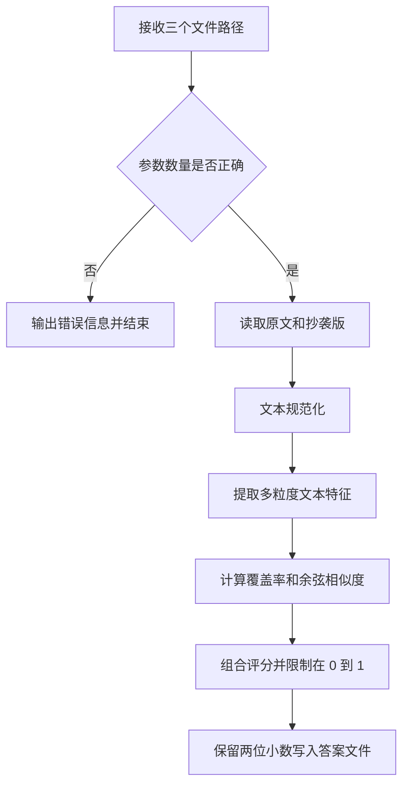

# 论文查重模块设计

## 1. 设计目标

程序需要读取原文和抄袭版论文，计算两篇文本的重复率，并把保留两位小数的结果写入指定文件。设计时重点考虑以下问题：

1. 输入输出必须符合命令行评测要求。
2. 相似度计算模块应当与文件读写分离，方便独立测试和替换算法。
3. 算法不能只比较两个字符串是否完全相同，还要识别增、删、改和局部调序后仍然存在的重复内容。
4. 程序需要在准确度、运行时间和代码复杂度之间取得平衡。

## 2. 输入输出约定

程序入口为 `main.py`，运行格式为：

```bash
python main.py [原文文件绝对路径] [抄袭版文件绝对路径] [答案文件绝对路径]
```

三个参数依次表示原文文件、抄袭版文件和答案文件。程序只读取前两个文件，并将最终重复率写入第三个文件。正常输出范围为 `0.00` 到 `1.00`。

## 3. 代码结构

```text
3124004132/
├── .gitignore
├── .coveragerc
├── main.py
├── plagiarism_checker.py
├── file_utils.py
├── requirements.txt
├── requirements-dev.txt
├── pyproject.toml
├── tests/
│   ├── test_main.py
│   ├── test_file_utils.py
│   └── test_plagiarism_checker.py
├── README.md
├── PSP.md
├── DESIGN.md
├── ALGORITHM_NOTES.md
├── QUALITY_REPORT.md
└── PERFORMANCE_REPORT.md
```

项目规模较小，暂时不设计需要保存状态的类，主要通过职责清晰的函数组织代码。

## 4. 模块与函数职责

| 模块 | 函数 | 主要职责 |
| --- | --- | --- |
| `main.py` | `main(argv=None)` | 检查命令行参数并组织完整处理流程 |
| `file_utils.py` | `read_text(path)` | 检查并读取论文文件 |
| `file_utils.py` | `write_result(path, similarity)` | 将重复率以两位小数写入答案文件 |
| `plagiarism_checker.py` | `normalize_text(text)` | 统一字符形式、大小写、空白和标点 |
| `plagiarism_checker.py` | `extract_features(text)` | 提取多粒度字符 n-gram 特征 |
| `plagiarism_checker.py` | `cosine_similarity(left, right)` | 计算两个特征向量的余弦相似度 |
| `plagiarism_checker.py` | `feature_overlap(left, right)` | 计算重复特征占较大特征集合的比例 |
| `plagiarism_checker.py` | `calculate_similarity(original, suspicious)` | 对外提供统一的重复率计算接口 |

`main.py` 只负责调用各模块，不直接实现查重算法。这样可以单独测试 `calculate_similarity()`，也可以在不改变命令行接口的情况下调整特征提取方法。

## 5. 程序流程



## 6. 查重算法思路

### 6.1 为什么不能只做逐字匹配

抄袭版可能对原文进行词语替换、句子增删或局部调序。如果只统计完全相同的连续字符串，少量改写就可能使重复率出现较大波动。

例如：

```text
原文：今天是星期日，天气晴，我晚上要去看电影。
改写：今天是周天，天气晴朗，今天晚上我要去看电影。
```

“星期日”和“周天”表达的是相近含义，“晴”和“晴朗”也保留了主要语义。两句话不是逐字相同，但整体内容和句子结构高度接近，算法应当识别出较高的重复程度，而不是把它们当成无关文本。

### 6.2 文本规范化

`normalize_text()` 当前完成以下处理：

1. 使用 Unicode NFKC 规范化统一全角、半角等字符形式。
2. 将英文统一为小写。
3. 移除换行、制表符、多余空白和标点。
4. 保留中文、英文、数字和数学符号等有效内容。

规范化阶段不判断词语是否同义，以免把含义不同的表达合并。局部词语变化交给后面的多粒度字符特征处理：上下文相同的部分继续参与计算，变化位置只损失一部分分数。

### 6.3 多粒度特征

设计初期考虑过两类特征：

- 字符级特征：对局部增删、词语变化和中文分词误差较稳定。
- 词语级特征：能保留较完整的语义信息，但中文分词通常需要额外依赖，也会增加评测环境部署的不确定性。

最后我选择只使用字符 n-gram，不引入中文分词库。`extract_features()` 会先调用文本规范化，再把文本转换为带频次的特征集合；这个通用接口默认提取一元和二元特征，完整查重流程则按设定权重提取一元、二元和三元特征。一元特征提高对增删和局部调序的容错性，二元、三元特征保留局部字符顺序。特征名称带有窗口长度前缀，避免不同粒度相互混淆。

### 6.4 相似度计算

两个文本的特征向量使用余弦相似度计算：

```text
similarity = dot(A, B) / (norm(A) * norm(B))
```

相似度越接近 `1`，说明两篇文本共享的特征越多；越接近 `0`，说明两篇文本差异越大。最终结果会限制在 `0` 到 `1` 之间，并由输出模块格式化为两位小数。

第一版只使用余弦相似度时，增加或删除一部分内容后，整篇文章的字符频率方向仍然很接近，结果容易偏高。因此最终评分增加了特征覆盖率：相同特征的频次取两边较小值，再除以两边较大的特征总数，让新增和删除都能反映到结果中。

当前算法使用一元、二元、三元字符特征，权重分别为 `0.75`、`0.20`、`0.05`。覆盖率占最终结果的 `0.80`，余弦相似度占 `0.20`。一元特征主要判断内容保留程度，二元和三元特征负责补充局部顺序，余弦部分则保留对整体频率分布的判断。

`calculate_similarity()` 作为查重模块的统一入口，依次完成文本规范化、特征提取、覆盖率和余弦相似度计算。完全相同或经过通用规范化后相同的文本重复率为 `1.0`；局部增删改会根据共享内容和顺序变化得到中间值。

## 7. 典型改写场景

目前的测试和算法说明覆盖以下场景：

| 场景 | 示例变化 | 期望表现 |
| --- | --- | --- |
| 完全相同 | 原文直接复制 | 重复率接近 `1.00` |
| 局部表达变化 | “星期日”替换为“周天” | 根据相同上下文得到部分重复率 |
| 词语扩展 | “晴”改为“晴朗” | 允许局部差异，整体仍较高 |
| 增加内容 | 在原文中插入新句子 | 比完全复制低，但保留原文重复部分 |
| 删除内容 | 删除原文中的部分句子 | 根据保留内容计算重复程度 |
| 局部调序 | 调整部分句子的先后顺序 | 不因顺序变化直接降为低重复 |
| 完全无关 | 两篇文本主题和措辞均不同 | 重复率接近 `0.00` |

这些场景既用于构造单元测试，也可以在博客的算法说明部分展示算法为什么采用规范化和多粒度特征。

## 8. 异常处理设计

当前已经处理以下异常：

1. 命令行参数数量不正确。
2. 原文或抄袭版文件不存在。
3. 输入路径不是普通文件。
4. 文件无法读取或文本编码不正确。
5. 输入文件为空或规范化后没有有效内容。
6. 答案文件所在目录不存在或没有写入权限。
7. 答案路径与任意一个输入文件相同，避免意外覆盖论文。

发生异常时，程序应输出明确的错误信息并以非零状态结束，避免写入一个看似正常但没有实际意义的重复率。

## 9. 测试设计

单元测试至少覆盖以下内容：

1. 两篇文本完全相同。
2. 两篇文本完全不同。
3. 局部表达变化。
4. 增加部分内容。
5. 删除部分内容。
6. 局部调序。
7. 标点和空白不同。
8. 中文与英文、数字混合。
9. 输入文件为空。
10. 输入文件不存在。
11. 命令行参数数量错误。
12. 输出结果格式为两位小数。

测试分别检查文本规范化、特征提取、相似度计算和完整命令行流程，避免只测试最终输出而无法定位错误。

## 10. 当前设计边界

输入输出约定、模块职责、命令行入口和可替换的算法接口均已实现。当前组合方式能够反映内容增删和局部调序，覆盖率和第一轮性能分析也已经完成。

这样的设计可以先保证程序结构稳定，再根据测试结果改进算法，而不需要反复修改主程序和文件读写代码。
